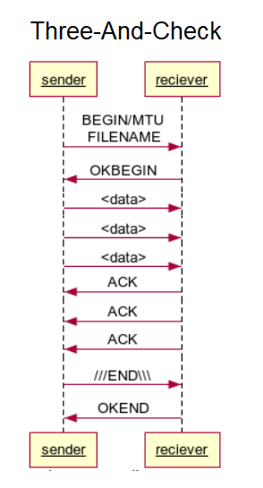
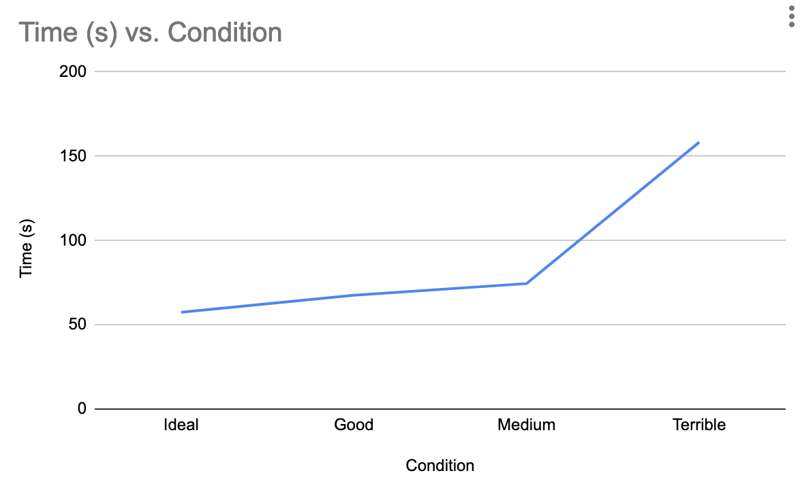

# Reliable Data Transfer

Computer Networking, Project 1. "ThreeAndCheck"

## Authors

- [@AidanGood](https://www.github.com/AidanGood)
- [@cet008](https://www.github.com/cet008)

## Protocol Sequence Diagram

## Analysis

In our implementation, the server sends 3 packets and then monitors the acknowledgments. The server will track the acknowledgements it receives, and send the next 3 packets based on the last received acknowledgement. The receiver checks the packet number (8 bytes) and throws away all packets that are not the next packet it needs and the checksum (32 bytes). Once it gets the packet it needs, it begins waiting for the next packet. It always sends an acknowledgement back with the next packet it is looking for. The packet numbers start at 0 and go up to the total number of packets needed.

Our algorithm passes all conditions.

## Transfer Rates

| Condition             | Time                                                                |
| ----------------- | ------------------------------------------------------------------ |
| Terrible | 158.36s |
| Medium | 74.43s |
| Good | 67.48s |
| Ideal | 57.46s |

